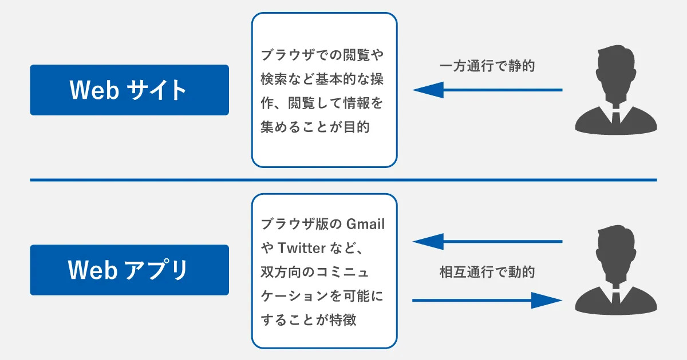

# Webアプリ開発をしてみよう

## はじめに
みなさんはWebアプリがどのようなものか知っていますか？ 
簡潔にいうとWebブラウザ上で動作するアプリケーションのことです。 
以下のようなものはみんなWebアプリです！ 
- YouTube
- X(Twitter)
- Amazon

### Webサイトとの違い
WebアプリとWebサイトの違いは簡単に説明すると、アクセスする私たちが、見る以外のことを行えるのがWebアプリ、見ることしか出来ないのがWebサイト

 
ここではPythonのDjangoというWebフレームワークを使って、Webアプリを作成していきます。Webフレームワークとは、Webアプリ開発をする際に、開発の効率を上げるために便利な機能がたくさん詰まったツールです。 

## 目次
1. [環境構築について](env.md)（作成中）
1. [Djangoについて](django.md)（作成中）
1. [HTML,CSSについて](htmlcss.md)（作成中）
1. [Git,Githubについて](gitgithub.md)（作成中）